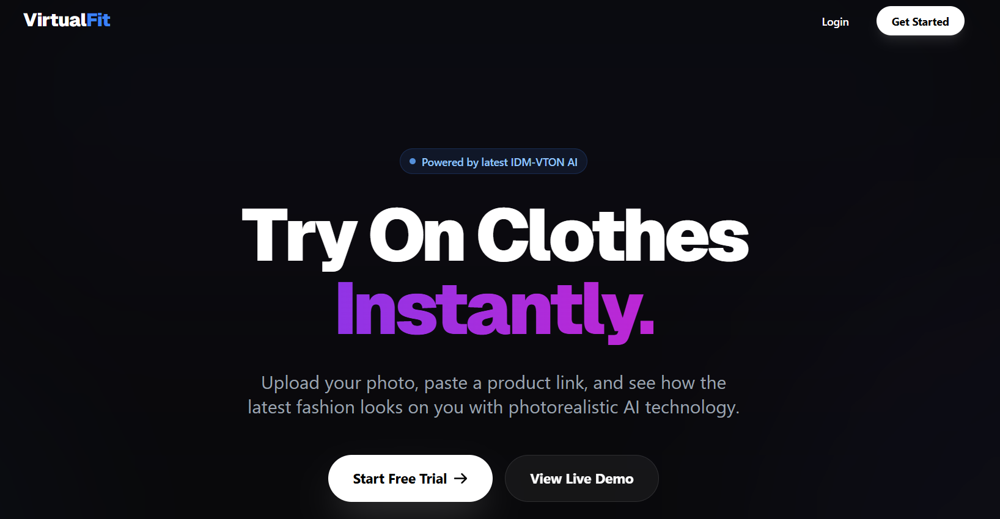
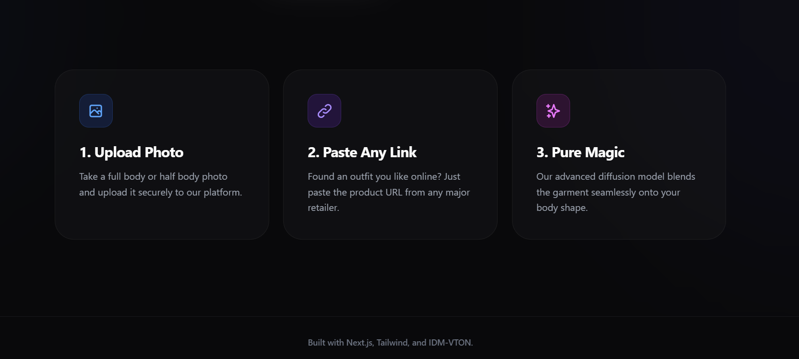
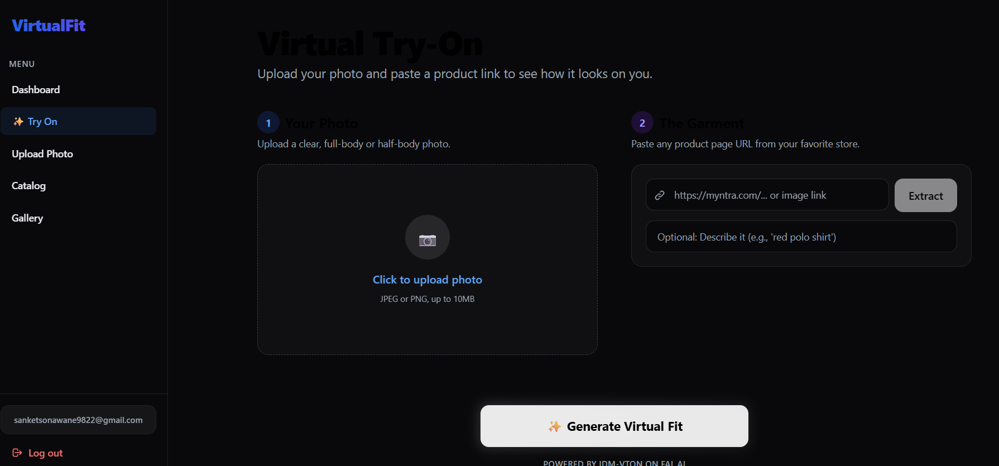

# ✨ VirtualFit

VirtualFit is a cutting-edge web application that allows users to virtually try on clothing using advanced AI diffusion models. Simply upload a photo of yourself, grab a product link from your favorite retail store, and instantly see how the outfit looks on you.

<p align="center">
  
  <br>
  <em>VirtualFit Landing Page</em>
</p>

<p align="center">
  
  <br>
  <em>VirtualFit Features</em>
</p>

<p align="center">
  
  <br>
  <em>VirtualFit Try-On Dashboard</em>
</p>

## 🚀 Features

- **Photorealistic Virtual Try-On**: Powered by **IDM-VTON** (via fal.ai / Hugging Face), seamlessly blending the garment onto your body shape, respecting skin tone, lighting, and original garment geometry.
- **Smart Product Extraction**: Paste any product URL (e.g., from Zara, H&M, Myntra) and our internal scraper automatically extracts the high-resolution product image.
- **Auto Background Removal**: Integrates with `ZhengPeng7/BiRefNet` via Gradio spaces to instantly remove noisy retail backgrounds from the garment before generation.
- **Premium UI/UX**: Built with Tailwind CSS, featuring deep dark mode, glassmorphism UI traits, floating animations, and a responsive masonry gallery.
- **Personal Lookbook**: All try-ons are securely stored in a personal gallery powered by Supabase.

## 🛠 Tech Stack

- **Frontend**: Next.js 14 (App Router), React, Tailwind CSS
- **Backend**: Next.js Server Actions & API Routes
- **Database & Auth**: Supabase (PostgreSQL, Row Level Security)
- **AI Models**: IDM-VTON for try-on, BiRefNet for object isolation
- **Data Scraping**: Cheerio

## ⚙️ Local Setup

1. **Clone the repository:**
   ```bash
   git clone https://github.com/your-username/virtualfit.git
   cd virtualfit
   ```

2. **Install dependencies:**
   ```bash
   npm install
   ```

3. **Configure Environment Variables:**
   Create a `.env` file in the root directory and add the following keys. You will need accounts on Supabase and a Replicate/fal.ai token depending on your endpoint configuration.
   
   ```env
   # Database & Auth
   NEXT_PUBLIC_SUPABASE_URL=your_supabase_project_url
   NEXT_PUBLIC_SUPABASE_ANON_KEY=your_supabase_anon_key
   
   # External Image Processing
   REPLICATE_API_TOKEN=your_replicate_token
   HF_TOKEN=your_huggingface_token # Optional: if using private HF APIs
   ```

4. **Initialize the Database:**
   Push the Prisma schema to your Supabase PostgreSQL instance:
   ```bash
   npx prisma db push
   npx prisma generate
   ```

5. **Run the Development Server:**
   ```bash
   npm run dev
   ```
   Open [http://localhost:3000](http://localhost:3000) in your browser.

## 🗄️ Supabase Storage Setup

To ensure image uploads work, you must create a public storage bucket in your Supabase dashboard:
1. Go to **Storage** in your Supabase project.
2. Click **New bucket** and name it `user-photos`.
3. Set the bucket to **Public**.

## 🤝 Contributing

Contributions are welcome! Please feel free to submit a Pull Request.

## 📄 License

This project is open-source and available under the [MIT License](LICENSE).
